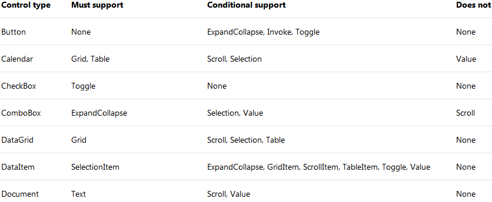
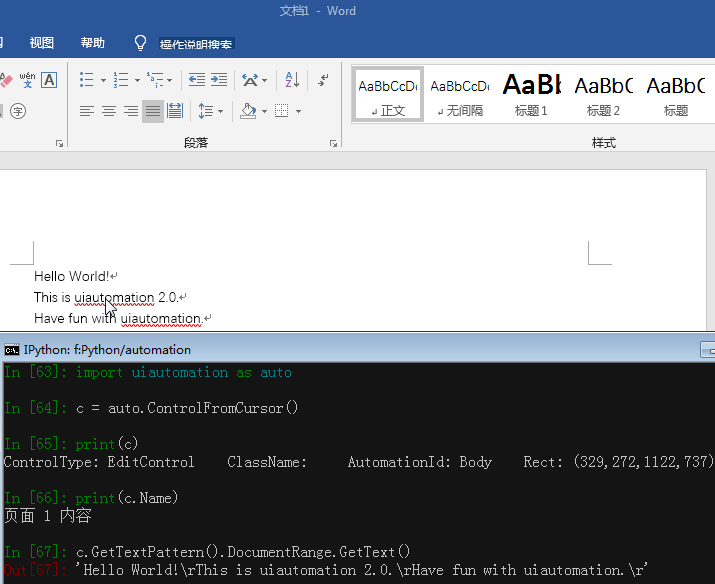

# The uiautomation module

:cn:[中文版介绍](https://github.com/yinkaisheng/Python-UIAutomation-for-Windows/blob/master/readme_cn.md)

Do not use 3.7.6 and 3.8.1, comtypes doesn't work in these two versions. Install an earlier version or the latest version.
https://github.com/enthought/comtypes/issues/202


This module is for [UIAutomation](https://docs.microsoft.com/en-us/windows/win32/winauto/ui-automation-specification) on Windows(Windows XP with SP3, Windows Vista, Windows 7 and Windows 8/8.1/10).
It supports UIAutomation for the applications which implmented UIAutomation Provider, such as MFC, Windows Form, WPF, Modern UI(Metro UI), Qt(Partly), Firefox(**version<=56 or >=60**), Chrome and Electron based apps(require **--force-renderer-accessibility** command line parameter).

I developed it in my spare time and for my personal use.

uiautomation is shared under the Apache Licence 2.0.  
This means that the code can be freely copied and distributed, and costs nothing to use.

uiautomation1.x supports py2, py3 and doesn't depend on any third package.

uiautomation2.0+ only supports py3 and depends on comtypes and typing(Python3.5+ built-in).  
uiautomation2.0+ is not backward compatible with early versions. See [API changes](https://github.com/yinkaisheng/Python-UIAutomation-for-Windows/blob/master/API%20changes.txt).

You can install uiautomation by "pip install uiautomation". After installation, a automation.py that calls uiautomation will be in 'C:\PythonXX\Scripts\'.
You use this script to traverse UI controls.

Run 'C:\PythonXX\Scripts\automation.py -h' for help.  
Run demos\automation_calculator.py to see a simple demo.

On Windows 8/8.1, to automate a Metro App, the app must be in foreground. If a Metro App was switched to background, uiautomation can't fetch its controls' information.

By the way, You should run python as **administrator**. Otherwise uiautomation may fail to enumerate controls or get controls' information on Windows 7 or higher.

[Requirements:](https://docs.microsoft.com/en-us/windows/win32/api/uiautomationclient/nn-uiautomationclient-iuiautomation)

Microsoft UIAutomation Minimum supported client:
Windows 7, Windows Vista with SP2 and Platform Update for Windows Vista, Windows XP with SP3 and Platform Update for Windows Vista [desktop apps only]

Microsoft UIAutomation Minimum supported server:
Windows Server 2008 R2, Windows Server 2008 with SP2 and Platform Update for Windows Server 2008, Windows Server 2003 with SP2 and Platform Update for Windows Server 2008 [desktop apps only]

C++ dll source code: [UIAutomationClient](https://github.com/yinkaisheng/UIAutomationClient)

---

How to use uiautomation?
run '**automation.py -h**'


Understand the arguments of automation.py, and try the following examples:  
**automation.py -t 0 -n**, print current active window's controls, show fullname  
**automation.py -r -d 1 -t 0**, print desktop(the root of control tree) and it's children(top level windows)  


automation.py prints the properties of controls and the patterns they support. 
You use controls and patterns to get controls' information and operate them.

A control should support some patterns or conditionally supports some patterns according to its control type.



Refer [Control Pattern Mapping for UI Automation Clients](https://docs.microsoft.com/en-us/windows/win32/winauto/uiauto-controlpatternmapping) for the full control pattern table.


uiautomation searches controls from the control tree based on the controls' properties you supply.

Suppose the control tree is  

root(Name='Desktop', Depth=0)  
　　window1(Depth=1)  
　　　　control1-001(Depth=2)  
　　　　control1-...(Depth=2)  
　　　　...  
　　　　control1-100(Depth=2)  
　　window2(Name='window2', Depth=1)  
　　　　control2-1(Depth=2)  
　　　　　　control2-1-001(Depth=3)  
　　　　　　control2-1-...(Depth=3)  
　　　　　　...  
　　　　　　control2-1-100(Depth=3)  
　　　　control2-2(Depth=2)  
　　　　control2-3(Depth=2)  
　　　　control2-4(Name='2-4', Depth=2)  
　　　　　　editcontrol(Name='myedit1', Depth=3)  
　　　　　　**editcontrol(Name='myedit2', Depth=3)**  

If you want to find the EditControl whose name is 'myedit2' and type 'hi',  
you can write the following code:

```python
uiautomation.EditControl(searchDepth=3, Name='myedit2').SendKeys('hi')
```

But this code run slowly because there are more than 200 controls before myedit2 in the control tree.  
uiautomation has to traverse more than 200 controls before finding myedit2 if search from root in 3 search depth.  
The better is:

```python
window2 = uiautomation.WindowControl(searchDepth=1, Name='window2') # search 2 times
sub = window2.Control(searchDepth=1, Name='2-4')    # search 4 times
edit = sub.EditControl(searchDepth=1, Name='myedit2')   # search 2 times
edit.SendKeys('hi')
```

This code run faster than the former.  
You can also combine the four lines code into one line.  

```python
uiautomation.WindowControl(searchDepth=1, Name='window2').Control(searchDepth=1, Name='2-4').EditControl(searchDepth=1, Name='myedit2').SendKeys('hi')
```

Now let's take notepad.exe for an example.  
Luanch notepad.exe and run automation.py -t 3, then swith to Notepad and wait for 5 seconds  

automation.py will print the controls of Notepad and save them to @AutomationLog.txt:  

ControlType: PaneControl    ClassName: #32769    Name: 桌面    Depth: 0    **(Desktop window, the root control)**  
　　ControlType: WindowControl    ClassName: Notepad    Depth: 1    **(Top level window)**  
　　　　ControlType: EditControl    ClassName: Edit    Depth: 2  
　　　　　　ControlType: ScrollBarControl    ClassName:     Depth: 3  
　　　　　　　　ControlType: ButtonControl    ClassName:     Depth: 4  
　　　　　　　　ControlType: ButtonControl    ClassName:     Depth: 4  
　　　　　　ControlType: ThumbControl    ClassName:     Depth: 3  
　　　　ControlType: TitleBarControl    ClassName:     Depth: 2  
　　　　　　ControlType: MenuBarControl    ClassName:     Depth: 3  
　　　　　　　　ControlType: MenuItemControl    ClassName:     Depth: 4  
　　　　　　ControlType: ButtonControl    ClassName:     Name: 最小化    Depth: 3    **(Minimize Button)**  
　　　　　　ControlType: ButtonControl    ClassName:     Name: 最大化    Depth: 3    **(Maximize Button)**  
　　　　　　ControlType: ButtonControl    ClassName:     Name: 关闭    Depth: 3    **(Close Button)**  
...  

Run the following code

```python
# -*- coding: utf-8 -*-
import subprocess
import uiautomation as auto

def test():
    print(auto.GetRootControl())
    subprocess.Popen('notepad.exe')
    # you should find the top level window first, then find children from the top level window
    notepadWindow = auto.WindowControl(searchDepth=1, ClassName='Notepad')
    if not notepadWindow.Exists(3, 1):
        print('Can not find Notepad window')
        exit(0)
    print(notepadWindow)
    notepadWindow.SetTopmost(True)
    # find the first EditControl in notepadWindow
    edit = notepadWindow.EditControl()
    # usually you don't need to catch exceptions
    # but if you meet a COMError exception, put it in a try block
    try:
        # use value pattern to get or set value
        edit.GetValuePattern().SetValue('Hello')# or edit.GetPattern(auto.PatternId.ValuePattern)
    except auto.comtypes.COMError as ex:
        # maybe you don't run python as administrator 
        # or the control doesn't have a implementation for the pattern method(I have no solution for this)
        pass
    edit.SendKeys('{Ctrl}{End}{Enter}World')
    print('current text:', edit.GetValuePattern().Value)
    # find the first TitleBarControl in notepadWindow, 
    # then find the second ButtonControl in TitleBarControl, which is the Maximize button
    notepadWindow.TitleBarControl().ButtonControl(foundIndex=2).Click()
    # find the first button in notepadWindow whose Name is '关闭', the close button
    # the relative depth from Close button to Notepad window is 2
    notepadWindow.ButtonControl(searchDepth=2, Name='关闭').Click()
    # then notepad will popup a window askes you to save or not, press hotkey alt+n not to save
    auto.SendKeys('{Alt}n')

if __name__ == '__main__':
    test()
```

auto.GetRootControl() returns the root control(the Desktop window)  
auto.WindowControl(searchDepth=1, ClassName='Notepad') creates a WindowControl, the parameters specify how to search the control  
the following parameters can be used  
searchFromControl = None,   
searchDepth = 0xFFFFFFFF,   
searchInterval = SEARCH_INTERVAL,   
foundIndex = 1  
Name  
SubName  
RegexName  
ClassName  
AutomationId  
ControlType  
Depth  
Compare  

See Control.\_\_init\_\_ for the comments of the parameters.  
See scripts in folder **demos** for more examples.  

Control.Element returns the low level COM object [IUIAutomationElement](https://docs.microsoft.com/en-us/windows/win32/api/uiautomationclient/nn-uiautomationclient-iuiautomationelement),
Almost all methods and properties of Control are implemented via IUIAutomationElement COM API and Win32 API.
when calling a control's method or property that indirectly calls Control.Element and Control.Element is None, 
uiautomation starts to search the control by the properties you supply.
uiautomation will raise a LookupError exception if it can't find the control in uiautomation.TIME_OUT_SECOND(default 10 seconds).
Control.Element will has a valid value if uiautomation finds the control successfully.
You can use Control.Exists(maxSearchSeconds, searchIntervalSeconds) to check whether a control Exists, this function doesn't raise any exception.
Call Control.Refind or Control.Exists to make Control.Element invalid again and uiautomation will starts a new search.  

For example:  
```python
#!python3
# -*- coding:utf-8 -*-
import subprocess
import uiautomation as auto
auto.uiautomation.SetGlobalSearchTimeout(15)  # set new timeout 15


def main():
    subprocess.Popen('notepad.exe')
    window = auto.WindowControl(searchDepth=1, ClassName='Notepad')
    # or use Compare for custom search
    # window = auto.WindowControl(searchDepth=1, ClassName='Notepad', Compare=lambda control,depth:control.ProcessId==100)
    edit = window.EditControl()
    # when calling SendKeys, uiautomation starts to search window and edit in 15 seconds
    # because SendKeys indirectly calls Control.Element and Control.Element is None
    # if window and edit don't exist in 15 seconds, a LookupError exception will be raised
    try:
        edit.SendKeys('first notepad')
    except LookupError as ex:
        print("The first notepad doesn't exist in 15 seconds")
        return
    # the second call to SendKeys doesn't trigger a search, the previous call makes sure that Control.Element is valid
    edit.SendKeys('{Ctrl}a{Del}')
    window.GetWindowPattern().Close()  # close the first Notepad, window and edit become invalid even though their Elements have a value

    subprocess.Popen('notepad.exe')  # run second Notepad
    window.Refind()  # need to refind window, trigger a new search
    edit.Refind()  # need to refind edit, trigger a new search
    edit.SendKeys('second notepad')
    edit.SendKeys('{Ctrl}a{Del}')
    window.GetWindowPattern().Close()  # close the second Notepad, window and edit become invalid again

    subprocess.Popen('notepad.exe')  # run third Notepad
    if window.Exists(3, 1): # trigger a new search
        if edit.Exists(3):  # trigger a new search
            edit.SendKeys('third notepad')  # edit.Exists makes sure that edit.Element has a valid value now
            edit.SendKeys('{Ctrl}a{Del}')
        window.GetWindowPattern().Close()
    else:
        print("The third notepad doesn't exist in 3 seconds")


if __name__ == '__main__':
    main()
```
---

**If automation.py can't print the controls you see.
Maybe the controls were built by DirectUI(or CustomControl), not UI Frameworks supplied by Microsoft.
In order to support UIAutomation, an UI Framework must implement [UI Automation Provider](https://docs.microsoft.com/en-us/windows/win32/winauto/uiauto-providersoverview).**

A Microsoft UI Automation provider is a software object that exposes an element of an application's UI so that accessibility client applications can retrieve information about the element and invoke its functionality. In general, each control or other distinct element in a UI has a provider.

Microsoft includes a provider for each of the standard controls that are supplied with Microsoft Win32, Windows Forms, and Windows Presentation Foundation (WPF). This means that the standard controls are automatically exposed to UI Automation clients; you do not need to implement any accessibility interfaces for the standard controls.

If your application includes any custom controls, you need to implement UI Automation providers for those controls to make them accessible to accessibility client applications. You also need to implement providers for any third party controls that do not include a provider. You implement a provider by implementing UI Automation provider interfaces and control pattern interfaces.

---

Another UI tool [Inspect.exe](https://docs.microsoft.com/en-us/windows/win32/winauto/inspect-objects) supplied by Microsoft can also be used to traverse the UI elements. It has an UI interface while my script shows UI elements in terminal.
But I found that my script is more convenient sometimes.


---

Some screenshots:

Batch rename pdf bookmark


Microsoft Word        



Wireshark 3.0 (Qt 5.12)


GitHub Desktop (Electron App)


Pretty print dir        


Donate：                                
 