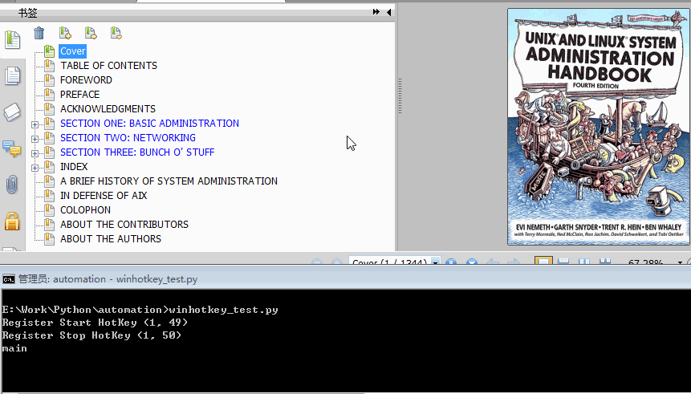
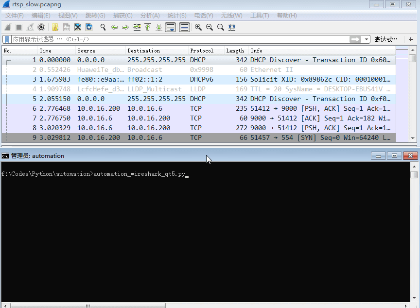
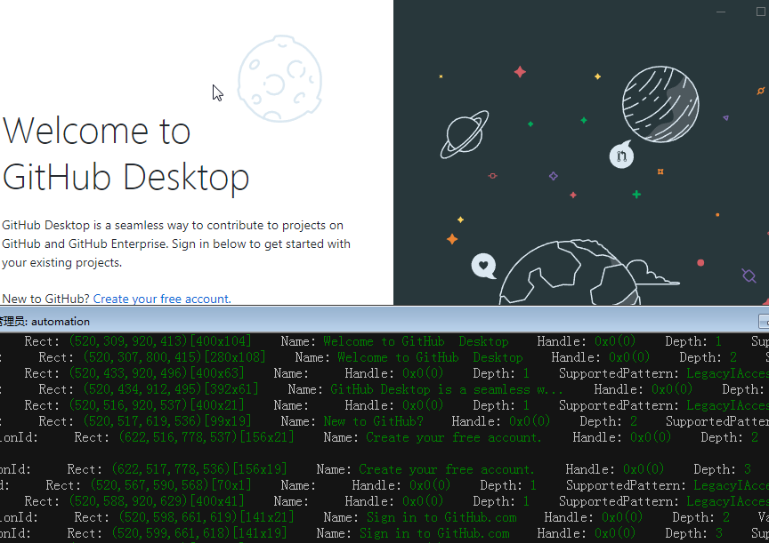
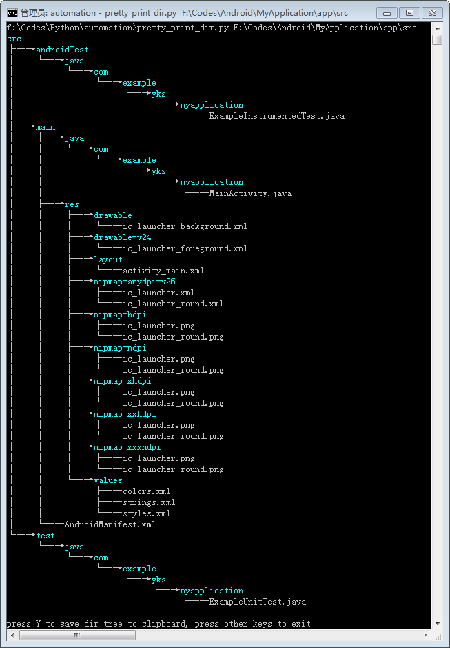

# uiautomation 模块

uiautomation是我业余时间开发的供我自己使用的一个模块。

uiautomation封装了微软UIAutomation API，支持自动化Win32，MFC，WPF，Modern UI(Metro UI), Qt, IE, Firefox(**version<=56 or >=60**, Firefox57是第一个Rust开发版本,前几个Rust开发版本个人测试发现不支持), Chrome和基于Electron开发的应用程序(Chrome浏览器和Electron应用需要加启动参数--force-renderer-accessibility才能支持UIAutomation).

最新版uiautomation2.0只支持Python 3版本，依赖comtypes和typing这两个包，但不要使用3.7.6和3.8.1这两个版本，comtypes在这两个版本中不能正常工作（[issue](https://github.com/enthought/comtypes/issues/202)）。

2.0版本之前的代码请参考[API changes](https://github.com/yinkaisheng/Python-UIAutomation-for-Windows/blob/master/API%20changes.txt)修改代码。

uiautomation支持在Windows XP SP3或更高版本的Windows桌面系统上运行。

如果是Windows XP系统，请确保系统目录有这个文件：UIAutomationCore.dll。如果没有，需要安装补丁
**[KB971513](https://github.com/yinkaisheng/WindowsUpdateKB971513ForIUIAutomation)** 才能支持UIAutomtion.

在Windows 7或更高版本Windows系统上使用uiautomation时，要以管理员权限运行Python，
否则uiautomation运行时很多函数可能会执行失败或抛出异常。
或者先以管理员权限运行cmd.exe，在cmd中再调用Python，如下图中cmd窗口标题中显示了**管理员**。

安装pip install uiautomation后，在Python的Scripts(比如C:\Python37\Scripts)目录中会有一个文件automation.py，
或者使用源码根目录里的automation.py。automation.py是用来枚举控件树结构的一个脚本。

运行'**automation.py -h**'，查看命令帮助，写自动化代码时要根据它的输出结果来写对应的代码。


理解上图中各个参数的意义并运行下面命令查看程序的执行结果。  
**automation.py -t 0**,   打印当前激活窗口的所有控件  
**automation.py -r -d 1 -t 0**, 打印桌面（树的根控件 ）和它的第一层子窗口（TopLevel顶层窗口）


automation.py 显示了控件树中的各个控件(Control)的部分属性和控件支持的Pattern.

根据微软 UIAutomation API，一个具体类型的Control必须支持或选择支持某种Pattern，如下图


参考 [Control Pattern Mapping for UI Automation Clients](https://docs.microsoft.com/en-us/windows/win32/winauto/uiauto-controlpatternmapping) 查看全部的Control-Pattern支持表格。

uiautomation中封装了Windows UIAutomation中的各个Control和Pattern.

Control类型有ButtonControl, TextControl, TreeControl等等。

Pattern类型有ExpandCollapsePattern,InvokePattern等等。

实际使用时，要用Control或Pattern对象来获取控件信息或操作控件。

uiautomation根据你提供的控件属性在控件树中从上往下查找控件。

假设控件树如下：

root(Name='Desktop', Depth=0)  
　　window1(Depth=1)  
　　　　control1-001(Depth=2)  
　　　　control1-...(Depth=2)  
　　　　...  
　　　　control1-100(Depth=2)  
　　window2(Name='window2', Depth=1)  
　　　　control2-1(Depth=2)  
　　　　　　control2-1-001(Depth=3)  
　　　　　　control2-1-...(Depth=3)  
　　　　　　...  
　　　　　　control2-1-100(Depth=3)  
　　　　control2-2(Depth=2)  
　　　　control2-3(Depth=2)  
　　　　control2-4(Name='2-4', Depth=2)  
　　　　　　editcontrol(Name='myedit1', Depth=3)  
　　　　　　**editcontrol(Name='myedit2', Depth=3)**  

如果你想找到名字为myedit2的EditControl，并在这个EditControl打字，你可以这样写：

```python
uiautomation.EditControl(searchDepth=3, Name='myedit2').SendKeys('hi')
```

但是这个代码运行效率并不高，因为控件树中有很多控件，你所查找的EditControl在树的末尾，
从树根部搜索整个控件树需要遍历200多次才能找到这个EditControl，
如果用分层查找并指定查找深度，就可以只查找几次，很快就能找到控件。

代码如下:

```python
window2 = uiautomation.WindowControl(searchDepth=1, Name='window2')#search 2 times
sub = window2.Control(searchDepth=1, Name='2-4')# search 4 times
edit = sub.EditControl(searchDepth=1, Name='myedit2')# search 2 times
edit.SendKeys('hi')
```

先在root的第一层子控件中查找window2，需要查找2次。
再在window2的第一层子控件中查找control2-4，需要查找4次。
最后在control2-4的第一层子控件中查找myedit2，需要查找2次。
总共需要查找8次就能找到控件。

你还可以 把上面的四行代码合并成一行：

```python
uiautomation.WindowControl(searchDepth=1, Name='window2').Control(searchDepth=1, Name='2-4').EditControl(searchDepth=1, Name='myedit2').SendKeys('hi')
```

下面来看下操作系统记事本程序的例子.  
运行notepad.exe，再运行automation.py -t 3，切换到记事本使记事本成为当前激活窗口，
3秒后automation.py就会把记事本的所有控件打印出来，并保存到日志文件@AutomationLog.txt。

在我的电脑上，输出如下:  

ControlType: PaneControl    ClassName: #32769    Name: 桌面    Depth: 0    **(桌面窗口,树的根控件)**  
　　ControlType: WindowControl    ClassName: Notepad    Depth: 1    **(顶层窗口，记事本窗口)**  
　　　　ControlType: EditControl    ClassName: Edit    Depth: 2  
　　　　　　ControlType: ScrollBarControl    ClassName:     Depth: 3  
　　　　　　　　ControlType: ButtonControl    ClassName:     Depth: 4  
　　　　　　　　ControlType: ButtonControl    ClassName:     Depth: 4  
　　　　　　ControlType: ThumbControl    ClassName:     Depth: 3  
　　　　ControlType: TitleBarControl    ClassName:     Depth: 2  
　　　　　　ControlType: MenuBarControl    ClassName:     Depth: 3  
　　　　　　　　ControlType: MenuItemControl    ClassName:     Depth: 4  
　　　　　　ControlType: ButtonControl    ClassName:     Name: 最小化    Depth: 3  
　　　　　　ControlType: ButtonControl    ClassName:     Name: 最大化    Depth: 3  
　　　　　　ControlType: ButtonControl    ClassName:     Name: 关闭    Depth: 3  
...  

运行如下代码：

```python
# -*- coding: utf-8 -*-
import subprocess
import uiautomation as auto

def test():
    print(auto.GetRootControl())
    subprocess.Popen('notepad.exe')
    # 首先从桌面的第一层子控件中找到记事本程序的窗口WindowControl，再从这个窗口查找子控件
    notepadWindow = auto.WindowControl(searchDepth=1, ClassName='Notepad')
    print(notepadWindow.Name)
    notepadWindow.SetTopmost(True)
    # 查找notepadWindow所有子孙控件中的第一个EditControl，因为EditControl是第一个子控件，可以不指定深度
    edit = notepadWindow.EditControl()
    try:
        # 获取EditControl支持的ValuePattern，并用Pattern设置控件文本为"Hello"
        edit.GetValuePattern().SetValue('Hello')# or edit.GetPattern(auto.PatternId.ValuePattern)
    except auto.comtypes.COMError as ex:
        # 如果遇到COMError, 一般是没有以管理员权限运行Python, 或者这个控件没有实现pattern的方法(如果是这种情况，基本没有解决方法)
        # 大多数情况不需要捕捉COMError，如果遇到了就加到try block
        pass
    edit.SendKeys('{Ctrl}{End}{Enter}World')# 在文本末尾打字
    print('current text:', edit.GetValuePattern().Value)# 获取当前文本
    # 先从notepadWindow的第一层子控件中查找TitleBarControl, 
    # 然后从TitleBarControl的子孙控件中找第二个ButtonControl, 即最大化按钮，并点击按钮
    notepadWindow.TitleBarControl(Depth=1).ButtonControl(foundIndex=2).Click()
    # 从notepadWindow前两层子孙控件中查找Name为'关闭'的按钮并点击按钮
    notepadWindow.ButtonControl(searchDepth=2, Name='关闭').Click()
    # 这时记事本弹出是否保存提示，按热键Alt+N不保存退出。
    auto.SendKeys('{Alt}n')

if __name__ == '__main__':
    test()
```

auto.GetRootControl()返回控件树的根节点(即桌面窗口Desktop)  
auto.WindowControl(searchDepth=1, ClassName='Notepad') 创建了一个WindowControl对象, 括号中的参数指定按照什么条件或控件属性在控件树中查找此控件。 

控件的\_\_init__函数中，有下列参数可以使用：  
searchFromControl = None,  从哪个控件开始查找，如果为None，从根节点Desktop开始查找  
searchDepth = 0xFFFFFFFF, 搜索深度  
searchInterval = SEARCH_INTERVAL, 搜索间隔  
foundIndex = 1 ，搜索到的满足搜索条件的控件索引，索引从1开始  
Name  控件名字  
SubName  控件部分名字  
RegexName  使用re.match匹配符合正则表达式的名字，Name,SubName,RegexName只能使用一个，不能同时使用  
ClassName 类名字  
AutomationId  控件AutomationId  
ControlType  控件类型  
Depth  控件相对于searchFromControl的精确深度  
Compare  自定义比较函数function(control: Control, depth: int)->bool

searchDepth和Depth的区别是：  
searchDepth在指定的深度范围内（包括1\~searchDepth层中的所有子孙控件）搜索第一个满足搜索条件的控件  
Depth只在Depth所在的深度（如果Depth>1，排除1\~searchDepth-1层中的所有子孙控件）搜索第一个满足搜索条件的控件

Control.Element返回IUIAutomation底层COM对象[IUIAutomationElement](https://docs.microsoft.com/en-us/windows/win32/api/uiautomationclient/nn-uiautomationclient-iuiautomationelement)，
基本上Control的所有属性或方法都是通过调用IUIAutomationElement COM API和Win32 API实现的。
当你使用一个Control的属性或方法时，属性或方法内部调用Control.Element并且Control.Element是None时uiautomation才开始搜索控件。
如果在uiautomation.TIME_OUT_SECOND(默认为10)秒内找不到控件，uiautomation就会抛出一个LookupError异常。
搜索到控件后，Control.Element将会有个有效值。
你可以调用Control.Exists(maxSearchSeconds, searchIntervalSeconds)来检查一个控件是否存在，此函数不会抛出异常。
另外可以调用Control.Refind或Control.Exists使Control.Element无效并触发重新搜索逻辑。

例子：  
```python
#!python3
# -*- coding:utf-8 -*-
import subprocess
import uiautomation as auto
auto.uiautomation.SetGlobalSearchTimeout(15)  # 设置全局搜索超时 15


def main():
    subprocess.Popen('notepad.exe')
    window = auto.WindowControl(searchDepth=1, ClassName='Notepad')
    # 或者使用Compare自定义搜索条件
    # window = auto.WindowControl(searchDepth=1, ClassName='Notepad', Compare=lambda control,depth:control.ProcessId==100)
    edit = window.EditControl()
    # 当第一次调用SendKeys时, uiautomation开始在15秒内搜索控件window和edit
    # 因为SendKeys内部会间接调用Control.Element并且Control.Element值是None
    # 如果在15秒内找不到window和edit，会抛出LookupError异常
    try:
        edit.SendKeys('first notepad')
    except LookupError as ex:
        print("The first notepad doesn't exist in 15 seconds")
        return
    # 第二次调用SendKeys不会触发搜索, 之前的调用保证Control.Element有效
    edit.SendKeys('{Ctrl}a{Del}')
    window.GetWindowPattern().Close()  # 关闭第一个Notepad, window和edit的Element虽然有值，但是无效了

    subprocess.Popen('notepad.exe')  # 运行第二个Notepad
    window.Refind()  # 必须重新搜索
    edit.Refind()  # 必须重新搜索
    edit.SendKeys('second notepad')
    edit.SendKeys('{Ctrl}a{Del}')
    window.GetWindowPattern().Close()  # 关闭第二个Notepad, window和edit的Element虽然有值，但是再次无效了

    subprocess.Popen('notepad.exe')  # 运行第三个Notepad
    if window.Exists(3, 1): # 触发重新搜索
        if edit.Exists(3):  # 触发重新搜索
            edit.SendKeys('third notepad')  # 之前的Exists保证edit.Element有效
            edit.SendKeys('{Ctrl}a{Del}')
        window.GetWindowPattern().Close()
    else:
        print("The third notepad doesn't exist in 3 seconds")


if __name__ == '__main__':
    main()
    
```

另外可以设置DEBUG_SEARCH_TIME查看搜索控件所遍历的控件数和搜索时间。
```python
import uiautomation as auto
auto.uiautomation.DEBUG_SEARCH_TIME = True
```
参考demos/automation_calculator.py

目录 **demos** 中提供了一些例子，请根据这些例子学习使用uiautomation.  

---

如果你发现automation.py不能打印你所看到的程序的控件，这并不是uiautomation的bug，
是因为这个程序是使用DirectUI或自定义控件实现的，不是用微软提供的标准控件实现的，
这个软件必须实现[UI Automation Provider](https://docs.microsoft.com/en-us/windows/win32/winauto/uiauto-providersoverview)才能支持UIAutomation。
微软提供的标准控件默认支持UIAutomation。

比如Chrome浏览器，默认你只能看到最外层的PaneControl Chrome_WidgetWin_1，看不到Chrome具体的子控件，
如果加了参数--force-renderer-accessibility运行Chrome浏览器，就能看到Chrome的子控件了。
这是因为Chrome实现了UI Automation Provider，并做了参数开关
。如果一个软件是用DirectUI实现的，但没有实现UI Automation Provider，那么这个软件是不支持UIAutomation的。

---

一些截图:

批量重命名pdf书签



获取Microsoft Word中的文本


Wireshark 3.0 (Qt 5.12)



GitHub Desktop (Electron App)



显示QQ        


打印好看的目录结构




捐助：                    
 